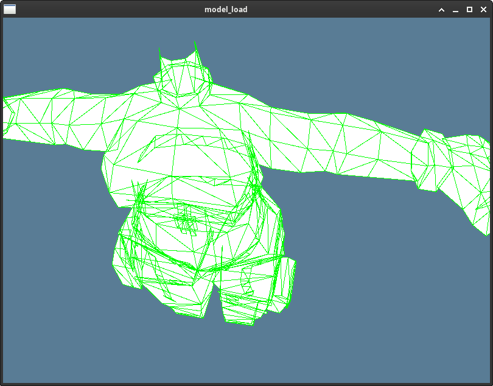

# wgpu gltf project

Short project im working on to read gltf projects. 

Check out the project at this directory. 

` wgpu_modelProject/examples/features/src/model_load/`

Currently its an updated version of the cube project. But the long term goal is to make an efficient web app. 

## Current state of the app

Loads in the gltf and displays it in the window
